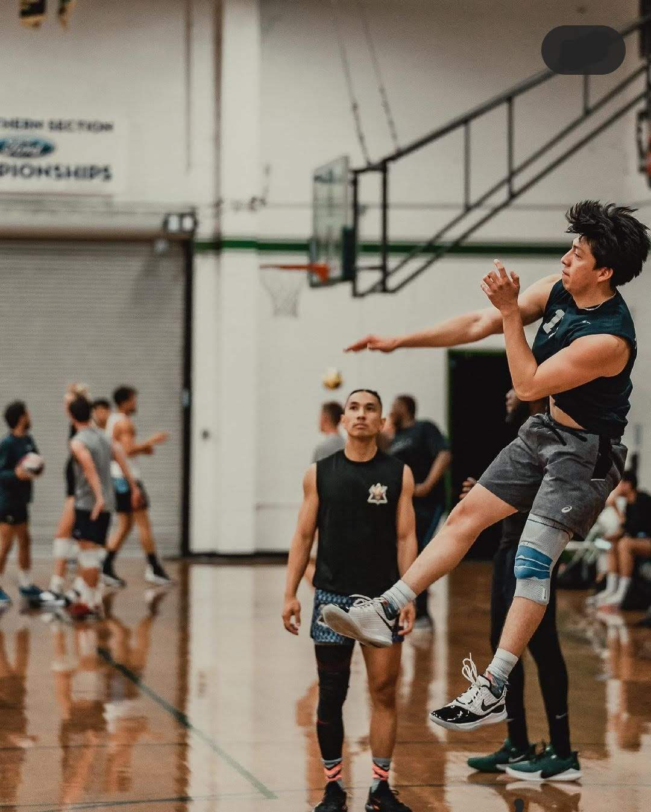

# [Christian Velasquez - UCSD Computer Engineering](#christian-velasquez---ucsd-computer-engineering)
> Do or do not there is no try

## [HOBBIES](#hobbies)


**Club Volleyball**

Tryouts for club are this [week!] (https://recreation.ucsd.edu/competitive-sports/teams/m-volleyball/)

**Working out**

One of my go to [Gym Songs](https://www.youtube.com/watch?v=dQw4w9WgXcQ)

**Youtube Videos**

Latest tournament I played with [friends](https://www.youtube.com/watch?v=q0HRdMcBtLM)

**FRIENDS!**


**GIT WORKFLOW**
```
git add 
git commit
git push
```


### [Life after college!](#life-after-college)
- Go to Hawaii
- Bench 2 plates
- Visit Guatemala
- Get a summer internship

Life Goals
1. Get bachelor's
2. Work in industry for a year
3. Get Masters?
4. Profit

- [ ] Poli 27 Essay
- [ ] CSE 101 Homework
- [ ] Math 20D Homework
- [x] CSE 110 Lab1